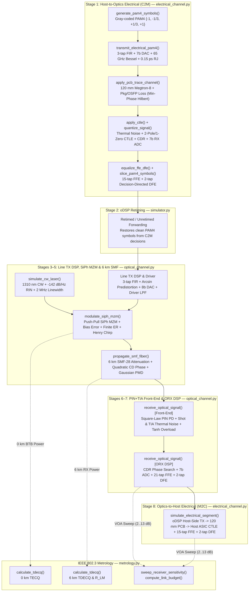

# 1.6T OSFP-DR8 (6 km) End-to-End Link Simulator — Comprehensive Function & Architecture Guide

**Project Path:** [`optics_1p6t_dr8_sim`](README.md)

This document provides an end-to-end architectural and mathematical reference for every module, configuration dataclass, and signal-processing/metrology function in the **1.6T OSFP-DR8 ($8 \times 200\text{G PAM4}$ at $106.25\text{ GBaud}$, $6\text{ km}$ SMF-28)** physical-layer simulator.

---

## 1. System Architecture & 8-Stage Signal Processing Pipeline

The simulator models a complete single-lane $200\text{ Gbps}$ ($106.25\text{ GBaud}$ PAM4) slice of an 8-lane $1.6\text{ Tbps}$ OSFP-DR8 transceiver link from the Host Switch/XPU ASIC SerDes transmitter, across the Host-to-Optics (C2M) PCB channel, through the 3nm oDSP and Silicon Photonics (SiPh) Mach-Zehnder Modulator (MZM), across $6\text{ km}$ of O-band Single-Mode Fiber (SMF-28), into the PIN-PD + TIA + Media RX (ORX) DSP, and finally back across the Optics-to-Host (M2C) electrical channel to the Host ASIC RX SerDes.

### Module Inventory

| Module | Role | Key Responsibilities |
| :--- | :--- | :--- |
| [`config.py`](../src/dr8sim/config.py) | Physical & DSP Parameter Definitions | Dataclasses for C2M/M2C electrical channels, CW laser, SiPh MZM, SMF-28 fiber, PIN+TIA+ORX receiver, and global simulation grids. |
| [`electrical_channel.py`](../src/dr8sim/electrical_channel.py) | 200G Electrical SerDes & PCB Channel | Gray-coded PAM4 generation/slicing, ENOB quantization, Bessel filters, causal minimum-phase PCB channels, CTLE, CDR alignment, and joint MMSE FFE+DFE equalization. |
| [`optical_channel.py`](../src/dr8sim/optical_channel.py) | Optical TX, SMF Fiber & ORX DSP | O-band CW laser (RIN + phase noise), $\arcsin$-predistorted push-pull SiPh MZM with chirp, Fourier-domain SMF chromatic dispersion & PMD, PIN+TIA shot/thermal noise, and 21-tap ORX equalization. |
| [`metrology.py`](../src/dr8sim/metrology.py) | IEEE 802.3ds / 802.3dj Metrology | PAM4 eye linearity ($R_{\text{LM}}$), IEEE Clause 121/171 5-tap reference equalizer TDECQ/TECQ calculator, VOA receiver sensitivity sweeps, and 6 km optical link power budgets. |
| [`simulator.py`](../src/dr8sim/simulator.py) | End-to-End Orchestration & Plotting | 8-stage pipeline execution, $0\text{--}6\text{ km}$ fiber reach sweeps, formatted engineering reports, and 6-panel diagnostic matplotlib dashboards. |
| [`main.py`](../src/dr8sim/cli.py) | CLI Entrypoint | Command-line flag parsing, simulation execution, JSON metrics export, and exit-code pass/fail verification against KP4 FEC thresholds. |

---

## 2. Configuration Module (`config.py`)

[`config.py`](../src/dr8sim/config.py) defines six hierarchical `@dataclass` structures that parameterize the physical link.

### 2.1 Dataclasses Overview

1. **[`HostChannelConfig`](../src/dr8sim/config.py)** — Parameterizes the IEEE 802.3dj $200\text{GBASE-AU}$ C2M (Stage 1) and M2C (Stage 8) electrical links:
   - **TX:** `tx_vppd = 0.80 V`, `tx_fir_taps = (-0.12, 0.82, -0.06)`, `tx_dac_bits = 7`, `tx_rj_rms_ps = 0.15 ps`, `tx_bw_ghz = 65.0 GHz`.
   - **PCB Channel:** `pcb_trace_length_mm = 120.0 mm`, `pcb_dielectric_loss_db_per_inch_ghz = 0.038`, `pcb_skin_loss_db_per_inch_sqrt_ghz = 0.18`, `package_connector_loss_db_at_nyquist = 3.5 dB` ($\approx 12.2\text{ dB}$ total channel loss at $53.125\text{ GHz}$ Nyquist).
   - **RX CTLE & DSP:** `ctle_dc_gain_db = -8.0 dB`, `ctle_peaking_gain_db = 8.5 dB`, `ctle_zero_ghz = 16.0 GHz`, `ctle_pole1_ghz = 53.125 GHz`, `ctle_pole2_ghz = 75.0 GHz`, `rx_noise_psd_mv_per_sqrt_ghz = 0.15`, `rx_adc_bits = 7` (`rx_adc_enob = 5.3`), `rx_ffe_taps = 15`, `rx_dfe_taps = 2`, `retimed_forwarding = True`.
2. **[`LaserConfig`](../src/dr8sim/config.py)** — Parameterizes the O-band Continuous-Wave (CW) DFB laser source:
   - `wavelength_nm = 1310.0 nm`, `wavelength_error_nm = 1.5 nm`, `freq_offset_ghz = 15.0 GHz`, `cw_power_dbm = 9.5 dBm`, `rin_db_hz = -142.0 dB/Hz`, `linewidth_mhz = 2.0 MHz`.
3. **[`MzmConfig`](../src/dr8sim/config.py)** — Parameterizes the oDSP Line TX DSP and Silicon Photonics (SiPh) traveling-wave push-pull Mach-Zehnder Modulator:
   - **Line TX DSP:** `line_tx_fir_taps = (-0.07, 0.84, -0.09)`, `line_tx_dac_bits = 8` (`line_tx_dac_enob = 5.6`), `enable_arcsin_predistortion = True`, `predistortion_gain = 0.82`, `driver_bw_ghz = 62.0 GHz`.
   - **SiPh MZM:** `vpi_volts = 4.0 V`, `drive_vpp_volts = 1.65 V`, `bias_phase_rad = pi/2` (quadrature), `bias_error_deg = 1.2 deg`, `intrinsic_er_db = 22.0 dB`, `target_outer_er_db = 5.0 dB`, `insertion_loss_db = 6.5 dB`, `eo_bw_ghz = 56.0 GHz`, `chirp_alpha = -0.35`.
4. **[`FiberConfig`](../src/dr8sim/config.py)** — Parameterizes the $6\text{ km}$ ITU-T G.652D / SMF-28e+ O-band single-mode fiber plant:
   - `length_km = 6.0 km`, `attenuation_db_per_km = 0.35 dB/km`, `connector_loss_db = 1.0 dB` (MPO-16 + patch panels), `splice_and_margin_loss_db = 0.2 dB`, `zero_dispersion_wavelength_nm = 1300.0 nm`, `dispersion_slope_ps_nm2_km = 0.092 ps/(nm^2*km)`, `pmd_ps_per_sqrt_km = 0.05 ps/sqrt(km)`, `mpi_penalty_db = 0.3 dB`.
5. **[`ReceiverConfig`](../src/dr8sim/config.py)** — Parameterizes the high-speed PIN Photodiode, linear TIA, Line RX ADC, and Media RX (ORX) DSP:
   - **PIN + TIA:** `responsivity_a_per_w = 0.85 A/W`, `dark_current_na = 10.0 nA`, `pd_bw_ghz = 65.0 GHz`, `tia_transimpedance_ohms = 2500.0 Ohm`, `tia_bw_ghz = 56.0 GHz`, `tia_irnd_pa_per_sqrt_hz = 16.0 pA/sqrt(Hz)`, `overload_power_dbm = 4.0 dBm`.
   - **Line RX ADC & ORX Equalizer:** `adc_bits = 7` (`adc_enob = 5.4`), `adc_bw_ghz = 62.0 GHz`, `orx_ffe_taps = 21`, `orx_dfe_taps = 2`, `orx_reference_tap = 10`, `target_pre_fec_ber = 2.4e-4` (KP4 FEC threshold), `target_tdecq_ser = 4.8e-4`.
6. **[`LinkSimulationConfig`](../src/dr8sim/config.py)** — Top-level container aggregating all sub-configs and exposing derived time/frequency grid properties:
   - [`symbol_period_s`](../src/dr8sim/config.py): $T_s = \frac{1}{R_s} = \frac{1}{106.25 \times 10^9\text{ Hz}} \approx 9.4118\text{ ps}$.
   - [`sample_rate_hz`](../src/dr8sim/config.py): $f_s = R_s \cdot N_{\text{sps}} = 106.25\text{ GBaud} \times 16 = 1.70\text{ THz}$.
   - [`dt_s`](../src/dr8sim/config.py): $\Delta t = \frac{1}{f_s} \approx 0.5882\text{ ps}$.
   - [`nyquist_freq_ghz`](../src/dr8sim/config.py): $f_N = \frac{R_s}{2} = 53.125\text{ GHz}$.
   - [`net_bit_rate_gbps_per_lane`](../src/dr8sim/config.py) & [`aggregate_bit_rate_tbps`](../src/dr8sim/config.py): $200\text{ Gbps/lane}$ and $1.6\text{ Tbps}$ aggregate across 8 lanes.

---

## 3. Electrical Channel Module (`electrical_channel.py`)

[`electrical_channel.py`](../src/dr8sim/electrical_channel.py) implements all electrical SerDes blocks used in both **Stage 1 (Host-to-Optics C2M)** and **Stage 8 (Optics-to-Host M2C)**, as well as shared DSP building blocks (quantization, Bessel filtering, CDR phase recovery, and FFE/DFE equalization) used by the optical receiver.

### 3.1 [`ElectricalLinkResult`](../src/dr8sim/electrical_channel.py)
Dataclass storing all intermediate and output signals of a 200G PAM4 electrical segment:
- `tx_symbols`, `tx_bits`, `tx_waveform_v`, `channel_out_waveform_v`, `ctle_out_waveform_v`
- `adc_samples`, `equalized_symbols`, `sliced_symbols`, `rx_bits`, `ffe_taps`, `dfe_taps`
- `sampling_phase`, `symbol_lag`, `channel_loss_at_nyquist_db`, `post_eq_snr_db`, `ser`, `ber`

---

### 3.2 [`generate_pam4_symbols(num_symbols, rng)`](../src/dr8sim/electrical_channel.py)
- **Purpose:** Generates a pseudo-random bit sequence of shape `(num_symbols, 2)` and maps each bit pair $(b_0, b_1)$ to normalized PAM4 levels $\{-1.0, -\frac{1}{3}, +\frac{1}{3}, +1.0\}$ using **IEEE 802.3 Gray coding** so that adjacent amplitude levels differ by exactly 1 bit.
- **Gray Mapping Table:**
  | Bit Pair $(b_0, b_1)$ | Level Index $m$ | Normalized Symbol Amplitude |
  | :---: | :---: | :---: |
  | `(0, 0)` | `0` | $-1.0$ |
  | `(0, 1)` | `1` | $-1/3$ |
  | `(1, 1)` | `2` | $+1/3$ |
  | `(1, 0)` | `3` | $+1.0$ |
- **Implementation:** Computes `level_indices = np.where(b0 == 0, b1, 3 - b1)` in a single vectorized operation and indexes `_PAM4_LEVELS`.

---

### 3.3 [`slice_pam4_symbols(samples, thresholds=None)`](../src/dr8sim/electrical_channel.py)
- **Purpose:** Hard-slices continuous equalized symbol samples against the three nominal PAM4 decision thresholds $\left[-\frac{2}{3}, 0.0, +\frac{2}{3}\right]$ and decodes them back to Gray-coded bit pairs.
- **Implementation:** Uses `np.digitize(samples, thresholds)` to obtain level indices $m \in \{0, 1, 2, 3\}$, then maps $m \to \text{PAM4 amplitude}$ via `_PAM4_LEVELS[indices]` and $m \to (b_0, b_1)$ via `_INDEX_TO_GRAY_BITS[indices]`.

---

### 3.4 [`quantize_signal(waveform, enob, full_scale_pp=None, rng=None)`](../src/dr8sim/electrical_channel.py)
- **Purpose:** Models finite-resolution DAC and ADC quantization with a specified **Effective Number of Bits ($\text{ENOB}$)**.
- **Mathematical Model:**
  1. Clips the signal to the symmetric full-scale range $\left[-\frac{V_{\text{FS}}}{2}, +\frac{V_{\text{FS}}}{2}\right]$.
  2. Computes the effective quantization step size:
     $$\Delta_{\text{LSB}} = \frac{V_{\text{FS}}}{2^{\text{ENOB}}}$$
  3. **Stochastic ENOB Mode (`rng` provided):** Models the composite effect of quantization step error, thermal noise floor, and harmonic distortion at $106.25\text{ GBaud}$ as additive white Gaussian quantization noise with standard deviation:
     $$\sigma_q = \frac{\Delta_{\text{LSB}}}{\sqrt{12}}$$
     and re-clips the output to $\pm \frac{V_{\text{FS}}}{2}$.
  4. **Deterministic Mode (`rng=None`):** Performs uniform mid-tread staircase rounding:
     $$y = \left(\text{round}\!\left(\frac{x_{\text{clipped}} + V_{\text{FS}}/2}{\Delta_{\text{LSB}}}\right) + 0.5\right)\Delta_{\text{LSB}} - \frac{V_{\text{FS}}}{2}$$

---

### 3.5 [`apply_bessel_lowpass(waveform, cutoff_ghz, sample_rate_hz, order=4)`](../src/dr8sim/electrical_channel.py)
- **Purpose:** Applies an $N$th-order maximally flat group-delay **Bessel-Thomson low-pass filter** in the frequency domain while stripping the bulk linear propagation delay so pulse centers remain aligned at sample index 0.
- **Mathematical Model:**
  1. Obtains normalized analog Bessel polynomial coefficients $(b, a)$ via `scipy.signal.bessel(order, 1.0, btype='low', analog=True, norm='mag')` where $|H(j\cdot 1)| = \frac{1}{\sqrt{2}}$ ($-3\text{ dB}$ at normalized frequency $1.0$).
  2. Evaluates $H(s)$ along the normalized imaginary axis $s = j \frac{f}{f_{3\text{dB}}}$ across the FFT frequency grid (`np.fft.rfftfreq` for real signals, `np.fft.fftfreq` for complex signals).
  3. **Bulk Delay Removal:** Extracts the DC group delay from the first two frequency bins:
     $$\tau_{\text{bulk}} = -\frac{\angle(H[1] / H[0])}{2\pi \Delta f}$$
     and multiplies $H(f)$ by $e^{+j 2\pi f \tau_{\text{bulk}}}$ so that only higher-order bandwidth limiting and group-delay dispersion remain.

---

### 3.6 [`apply_pcb_trace_channel(...)`](../src/dr8sim/electrical_channel.py)
- **Purpose:** Models the frequency-dependent insertion loss and causal minimum-phase dispersion of a differential PCB stripline trace (e.g., $120\text{ mm}$ Megtron-8) plus BGA package and OSFP connector transitions.
- **Insertion Loss Model ($\text{dB}$):**
  Given trace length in inches $L_{\text{in}} = \frac{L_{\text{mm}}}{25.4}$ and frequency $f_{\text{GHz}}$:
  $$\text{IL}_{\text{skin}}(f) = k_{\text{skin}} \cdot L_{\text{in}} \cdot \sqrt{f_{\text{GHz}}}$$
  $$\text{IL}_{\text{diel}}(f) = k_{\text{diel}} \cdot L_{\text{in}} \cdot f_{\text{GHz}}$$
  $$\text{IL}_{\text{pkg}}(f) = \text{IL}_{\text{pkg}}(f_N) \cdot \sqrt{\frac{f_{\text{GHz}}}{f_{N,\text{GHz}}}}$$
  $$\text{IL}_{\text{total}}(f) = \text{IL}_{\text{skin}}(f) + \text{IL}_{\text{diel}}(f) + \text{IL}_{\text{pkg}}(f), \qquad |H(f)| = 10^{-\text{IL}_{\text{total}}(f)/20}$$
- **Causal Minimum-Phase Reconstruction (Cepstral Hilbert Transform):**
  A physical passive transmission line cannot have zero phase; its phase response is uniquely tied to its log-magnitude response via the Kramers-Kronig / Hilbert transform relations. The function constructs the exact causal minimum-phase transfer function via the real cepstrum:
  1. Forms the two-sided symmetric log-magnitude spectrum $\ln|H_{\text{full}}[k]|$ of length $N$.
  2. Computes the inverse FFT $c[n] = \text{IFFT}(\ln|H_{\text{full}}[k]|)$.
  3. Applies the causal cepstral window $w[n]$ (`1` at $n=0$ and $n=N/2$, `2` for causal positive times $1 \le n < N/2$, and `0` for acausal negative times $n > N/2$).
  4. Transforms back via $\Phi_{\text{min}}(f) = \text{Im}\{\text{FFT}(c[n] w[n])\}$ and strips the bulk propagation delay evaluated at $0.25 f_N$ so the main cursor stays centered in the simulation window.

---

### 3.7 [`apply_ctle(...)`](../src/dr8sim/electrical_channel.py)
- **Purpose:** Models an analog **Continuous-Time Linear Equalizer (CTLE)** with 1 zero and 2 poles to provide high-frequency peaking near the $53.125\text{ GHz}$ Nyquist frequency while attenuating low-frequency energy.
- **Transfer Function:**
  $$H_{\text{raw}}(s) = \frac{1 + \frac{s}{\omega_{z,\text{eff}}}}{\left(1 + \frac{s}{\omega_{p1}}\right)\left(1 + \frac{s}{\omega_{p2}}\right)}$$
  where:
  - $f_{z,\text{eff}} = \min\!\left(f_z,\; \frac{f_{p1}}{10^{|\text{dc\_gain\_db}|/20}}\right)$ guarantees the requested DC-to-peak boost ratio $20\log_{10}(f_{p1}/f_{z,\text{eff}})$,
  - $H(s)$ is normalized so that $\max_f |H(j2\pi f)| = 10^{\text{peaking\_gain\_db}/20}$,
  - Bulk linear phase delay is removed via the first-bin phase slope before applying `np.fft.irfft`.

---

### 3.8 [`transmit_electrical_pam4(...)`](../src/dr8sim/electrical_channel.py)
- **Purpose:** Generates the oversampled Host or Module electrical TX waveform with 3-tap FIR pre-emphasis, DAC quantization, analog driver roll-off, and random timing jitter (RJ).
- **Step-by-Step Pipeline:**
  1. **3-Tap Symbol-Spaced TX FIR:** Normalizes `fir_taps` by its $L_1$ norm ($\sum |h_k| = 1$) so the peak-to-peak voltage swing never exceeds `vppd`, then convolves with `symbols`.
  2. **Voltage Scaling & TX DAC Quantization:** Scales the pre-emphasized symbols by $\frac{V_{\text{ppd}}}{2}$ and quantizes via [`quantize_signal`](../src/dr8sim/electrical_channel.py) at $\text{ENOB}_{\text{DAC}} = \min(B_{\text{DAC}}, B_{\text{DAC}} - 1.2)$.
  3. **Zero-Order Hold Upsampling & Analog TX Bandwidth:** Upsamples by `sps` (`np.repeat`) and filters through a 4th-order Bessel low-pass filter at `tx_bw_ghz` ($65\text{ GHz}$).
  4. **Random Timing Jitter (RJ) Injection:** Generates per-symbol Gaussian timing offsets $\Delta t_k \sim \mathcal{N}(0, \sigma_{\text{RJ}}^2)$ (smoothed across symbol boundaries) and applies a first-order Taylor phase-noise perturbation using the time derivative of the waveform:
     $$v_{\text{jittered}}(t) = v(t) + \frac{dv(t)}{dt} \cdot \Delta t(t)$$

---

### 3.9 [`find_optimal_sampling_phase(waveform, tx_symbols, sps)`](../src/dr8sim/electrical_channel.py) & [`align_symbol_sequence(samples, lag, polarity=1.0)`](../src/dr8sim/electrical_channel.py)
- **Purpose:** Emulates Clock and Data Recovery (CDR) sampling phase lock and frame synchronization.
- **Algorithm:**
  - Sweeps all candidate sampling phases $\phi \in \{0, 1, \dots, \text{sps}-1\}$ and integer symbol lags $L \in [-24, +24]$.
  - At each $(\phi, L)$, extracts symbol-spaced samples $y_\phi[n] = \text{waveform}[\phi :: \text{sps}]$ and computes the normalized cross-correlation against the reference `tx_symbols` $x$:
    $$\rho(\phi, L) = \frac{\langle x,\, \text{shift}(y_\phi, -L) \rangle}{\|x\|_2 \, \|y_\phi\|_2}$$
  - Returns `(best_phase, best_lag, polarity_sign)` that maximizes $|\rho(\phi, L)|$.
  - [`align_symbol_sequence`](../src/dr8sim/electrical_channel.py) multiplies by `polarity` and applies `np.roll(samples, -lag)` so sample index $k$ corresponds directly to transmitted symbol $k$.

---

### 3.10 [`equalize_ffe_dfe(...)`](../src/dr8sim/electrical_channel.py)
- **Purpose:** Performs joint Minimum Mean-Square Error (MMSE) training and decision-directed execution of a symbol-spaced **Feed-Forward Equalizer (FFE)** and **Decision Feedback Equalizer (DFE)**, followed by post-equalizer SNR, SER, and BER evaluation.
- **Mathematical Model:**
  1. **Joint MMSE Training (Wiener-Hopf Normal Equations):**
     Over the first `training_fraction = 35%` of symbols, constructs a regression matrix $A \in \mathbb{R}^{N_{\text{train}} \times (N_{\text{FFE}} + N_{\text{DFE}})}$ where row $r$ (corresponding to symbol index $k$) contains:
     - **FFE inputs:** $\big[y[k + n_{\text{ref}}],\; y[k + n_{\text{ref}} - 1],\; \dots,\; y[k + n_{\text{ref}} - (N_{\text{FFE}} - 1)]\big]$
     - **DFE inputs:** $\big[-x_{\text{tx}}[k - 1],\; -x_{\text{tx}}[k - 2],\; \dots,\; -x_{\text{tx}}[k - N_{\text{DFE}}]\big]$
     Solves the Tikhonov-regularized normal equations for the joint tap vector $w = [w_{\text{FFE}}^T, w_{\text{DFE}}^T]^T$:
     $$\left(A^T A + \lambda N_{\text{train}} I\right) w = A^T x_{\text{tx,train}}$$
  2. **Decision-Directed DFE Execution Loop:**
     First computes the linear FFE output across all $N$ symbols via convolution:
     $$z_{\text{FFE}}[k] = \sum_{m=0}^{N_{\text{FFE}}-1} w_{\text{FFE}}[m]\, y[k + n_{\text{ref}} - m]$$
     Then runs a sequential symbol-by-symbol decision-directed feedback loop so any slicer error propagates realistically through the DFE taps:
     $$z_{\text{eq}}[k] = z_{\text{FFE}}[k] - \sum_{d=1}^{N_{\text{DFE}}} w_{\text{DFE}}[d - 1]\, \hat{x}[k - d]$$
     where $\hat{x}[k - d] \in \{-1, -\frac{1}{3}, +\frac{1}{3}, +1\}$ is the hard-sliced PAM4 decision from symbol $k - d$.
  3. **Post-Equalizer SNR & Hybrid Monte-Carlo / Analytical SER & BER:**
     - Computes decision-point error $e[k] = z_{\text{eq}}[k] - x_{\text{tx}}[k]$ over the steady-state post-training region ($k \ge N_{\text{train}}$):
       $$\text{SNR}_{\text{post-eq (dB)}} = 10\log_{10}\!\left(\frac{\mathbb{E}[x_{\text{tx}}^2]}{\mathbb{E}[e^2]}\right)$$
     - Counts direct Monte Carlo symbol and bit errors. Because $N = 16{,}384$ symbols cannot resolve $\text{BER} < 10^{-4}$ by direct counting alone, whenever fewer than 10 symbol errors are observed, the function blends in the analytical PAM4 Gaussian noise tail probability based on the half-eye distance $d_{\min} = \frac{1}{3}$ and measured RMS error $\sigma_e = \sqrt{\mathbb{E}[e^2]}$:
       $$\text{SER}_{\text{analytical}} = \frac{3}{2}\,\text{erfc}\!\left(\frac{1/3}{\sqrt{2}\,\sigma_e}\right) = 3\,Q\!\left(\frac{1}{3\sigma_e}\right), \qquad \text{BER}_{\text{analytical}} = \frac{1}{2}\,\text{SER}_{\text{analytical}}$$

---

### 3.11 [`simulate_electrical_segment(tx_symbols, tx_bits, sim_cfg, host_cfg, rng)`](../src/dr8sim/electrical_channel.py)
- **Purpose:** End-to-end orchestrator for a single $200\text{G PAM4}$ electrical link (called twice per simulation: once for **Stage 1 Host-to-Optics C2M** and once for **Stage 8 Optics-to-Host M2C**).
- **Execution Sequence:**
  1. Calls [`transmit_electrical_pam4`](../src/dr8sim/electrical_channel.py) to generate the TX waveform.
  2. Passes the waveform through [`apply_pcb_trace_channel`](../src/dr8sim/electrical_channel.py).
  3. Injects input-referred receiver thermal noise with $\sigma_v = \text{PSD}_{\text{rx}} \times 10^{-3} \sqrt{0.75 \, R_s\text{ (GHz)}}$.
  4. Applies [`apply_ctle`](../src/dr8sim/electrical_channel.py) to boost the Nyquist band.
  5. Recovers optimal sampling phase and symbol alignment via [`find_optimal_sampling_phase`](../src/dr8sim/electrical_channel.py) and [`align_symbol_sequence`](../src/dr8sim/electrical_channel.py).
  6. Quantizes symbol-spaced samples via the RX ADC ([`quantize_signal`](../src/dr8sim/electrical_channel.py)).
  7. Runs [`equalize_ffe_dfe`](../src/dr8sim/electrical_channel.py) ($15$-tap FFE + $2$-tap DFE) and [`slice_pam4_symbols`](../src/dr8sim/electrical_channel.py), returning an [`ElectricalLinkResult`](../src/dr8sim/electrical_channel.py).

---

## 4. Optical Channel Module (`optical_channel.py`)

[`optical_channel.py`](../src/dr8sim/optical_channel.py) models **Stages 3 through 7**: the O-band CW laser, Line TX DSP + SiPh MZM modulator, $6\text{ km}$ SMF-28 fiber propagation, PIN photodiode + TIA front-end, and the 21-tap Media RX (ORX) DSP.

### 4.1 [`OpticalSubLinkResult`](../src/dr8sim/optical_channel.py)
Dataclass encapsulating all optical and electrical-equivalent signals across Stages 3–7:
- **Waveforms & Complex Fields:** `laser_field_sqrt_w`, `mzm_drive_waveform_v`, `tx_optical_field_sqrt_w`, `tx_optical_power_mw`, `rx_optical_field_sqrt_w`, `rx_optical_power_mw`, `photocurrent_ma`, `tia_out_voltage_v`
- **ORX DSP Outputs:** `orx_adc_samples`, `orx_equalized_symbols`, `orx_sliced_symbols`, `orx_rx_bits`, `orx_ffe_taps`, `orx_dfe_taps`, `sampling_phase`, `symbol_lag`
- **Transmitter & Channel Metrics:** `effective_wavelength_nm`, `tx_avg_power_dbm`, `tx_oma_dbm`, `tx_outer_er_db`, `tx_level_powers_mw`, `chromatic_dispersion_ps_nm_km`, `total_dispersion_ps_nm`, `fiber_loss_db`
- **Receiver Metrics:** `rx_avg_power_dbm`, `rx_oma_dbm`, `shot_noise_rms_ua`, `thermal_noise_rms_ua`, `orx_post_eq_snr_db`, `orx_ser`, `orx_ber`

---

### 4.2 Utility Functions: [`mw_to_dbm`](../src/dr8sim/optical_channel.py), [`dbm_to_mw`](../src/dr8sim/optical_channel.py), and [`compute_effective_wavelength_nm`](../src/dr8sim/optical_channel.py)
- **[`mw_to_dbm(power_mw)`](../src/dr8sim/optical_channel.py) / [`dbm_to_mw(power_dbm)`](../src/dr8sim/optical_channel.py):** Convert between linear milliwatts and $\text{dBm}$ ($P_{\text{dBm}} = 10\log_{10}(\max(P_{\text{mW}}, 10^{-15}))$).
- **[`compute_effective_wavelength_nm(laser_cfg)`](../src/dr8sim/optical_channel.py):** Combines nominal wavelength $\lambda_0$, static manufacturing/thermal offset $\Delta\lambda_{\text{err}}$, and fine frequency offset $\Delta f$ via the differential relation $\Delta\lambda \approx -\frac{\lambda^2}{c}\Delta f$:
  $$\lambda_{\text{eff}} = (\lambda_0 + \Delta\lambda_{\text{err}}) - \frac{(\lambda_0 + \Delta\lambda_{\text{err}})^2}{c}\Delta f$$
  For the default config ($\lambda_0 = 1310\text{ nm}$, $\Delta\lambda_{\text{err}} = +1.5\text{ nm}$, $\Delta f = +15\text{ GHz}$), $\lambda_{\text{eff}} \approx 1311.41\text{ nm}$.

---

### 4.3 [`simulate_cw_laser(num_samples, sample_rate_hz, laser_cfg, rng)`](../src/dr8sim/optical_channel.py)
- **Purpose:** Synthesizes the complex baseband optical electric field $E_{\text{laser}}(t)$ (in $\sqrt{\text{W}}$) of the O-band CW DFB laser with Relative Intensity Noise (RIN) and Lorentzian Wiener phase noise.
- **Mathematical Model:**
  1. **Relative Intensity Noise (RIN):** Given $\text{RIN}_{\text{linear}} = 10^{\text{RIN}_{\text{dB/Hz}}/10}$ and single-sided Nyquist simulation bandwidth $B_{\text{sim}} = \frac{f_s}{2}$:
     $$\sigma_{\text{RIN}} = \sqrt{\text{RIN}_{\text{linear}} \cdot \frac{f_s}{2}}$$
     Generates $\delta_P[n] \sim \mathcal{N}(0, \sigma_{\text{RIN}}^2)$, filters it through a $45\text{ GHz}$ 2nd-order Bessel low-pass filter to model laser relaxation-oscillation damping, and rescales it to preserve exact in-band variance:
     $$P_{\text{inst}}[n] = \max\!\big(P_0 (1 + \delta_P[n]),\; 0.05 P_0\big)$$
  2. **Wiener Phase Noise:** Models a Lorentzian laser lineshape of FWHM $\Delta\nu$ as a Brownian random walk with per-sample phase increment variance $\sigma_{\Delta\phi}^2 = 2\pi \Delta\nu \Delta t$:
     $$\phi[n] = \sum_{k=0}^{n} \Delta\phi[k], \qquad \Delta\phi[k] \sim \mathcal{N}\!\left(0,\; \frac{2\pi \Delta\nu}{f_s}\right)$$
  3. **Complex Field Output:**
     $$E_{\text{laser}}[n] = \sqrt{P_{\text{inst}}[n]} \, e^{j\phi[n]} \quad [\sqrt{\text{W}}]$$

---

### 4.4 [`compute_drive_vpp_for_target_er(target_er_db, vpi_volts, intrinsic_er_db)`](../src/dr8sim/optical_channel.py)
- **Purpose:** Analytically inverts the quadrature-biased push-pull MZM transfer function to determine the exact peak-to-peak differential drive voltage $V_{\text{pp}}$ needed to achieve a target outer Extinction Ratio ($\text{ER}_{\text{target}}$, e.g., $5.0\text{ dB}$) given $V_\pi$ and finite interferometer extinction ratio $\text{ER}_{\text{int}}$.
- **Mathematical Model:**
  1. Computes the effective target linear extinction ratio accounting for finite MZM arm-imbalance floor:
     $$\text{ER}_{\text{eff}} = \min\!\left(10^{\text{ER}_{\text{target,dB}}/10},\; 0.95 \times 10^{\text{ER}_{\text{int,dB}}/10}\right)$$
  2. Since $P(\pm V_{\text{pp}}/2) \propto 1 \pm \sin\!\left(\frac{\pi V_{\text{pp}}}{2 V_\pi}\right)$, solving $\frac{1 + \sin(\pi V_{\text{pp}} / 2V_\pi)}{1 - \sin(\pi V_{\text{pp}} / 2V_\pi)} = \text{ER}_{\text{eff}}$ yields:
     $$\sin\!\left(\frac{\pi V_{\text{pp}}}{2 V_\pi}\right) = \frac{\text{ER}_{\text{eff}} - 1}{\text{ER}_{\text{eff}} + 1} \implies V_{\text{pp}} = \frac{2 V_\pi}{\pi} \arcsin\!\left(\frac{\text{ER}_{\text{eff}} - 1}{\text{ER}_{\text{eff}} + 1}\right)$$
     For $\text{ER}_{\text{target}} = 5.0\text{ dB}$ and $V_\pi = 4.0\text{ V}$, this gives $V_{\text{pp}} \approx 1.384\text{ V}_{\text{ppd}}$.

---

### 4.5 [`modulate_siph_mzm(symbols, laser_field_sqrt_w, sim_cfg, mzm_cfg, rng)`](../src/dr8sim/optical_channel.py)
- **Purpose:** Simulates **Stage 4**: the oDSP Line TX digital pre-emphasis, $\arcsin$ nonlinear pre-distortion, 8-bit Line TX DAC, RF driver + MZM electro-optic bandwidth roll-off, and the push-pull SiPh Mach-Zehnder Modulator complex field modulation.
- **Mathematical Model:**
  1. **DC-Normalized Line TX FIR:** Normalizes `line_tx_fir_taps` so $\sum h_k = 1.0$. Unlike the electrical host channel (which is peak-swing constrained and $L_1$-normalized), normalizing to unit DC gain keeps steady-state PAM4 runs at $\pm 1.0$ so the static outer Extinction Ratio is preserved while high-frequency transitions are peaked to pre-compensate MZM bandwidth roll-off.
  2. **$\arcsin$ Nonlinear Pre-Distortion:**
     Because the quadrature MZM power transfer curve is sinusoidal ($\propto 1 + \sin(\pi V / V_\pi)$), large voltage swings compress the outer PAM4 eyes ($0\leftrightarrow 1$ and $2\leftrightarrow 3$) relative to the center eye ($1\leftrightarrow 2$), degrading $R_{\text{LM}}$. When `enable_arcsin_predistortion=True`, the DSP pre-warps the normalized signal $x[k]$ using:
     $$V_{\text{drive}}[k] = \frac{V_\pi}{\pi} \arcsin\!\Big(\text{clip}\big(\sin\!\left(\frac{\pi V_{\text{pp}}}{2 V_\pi}\right) \cdot x[k],\; -0.98,\; +0.98\big)\Big)$$
     so that $\sin\!\left(\frac{\pi V_{\text{drive}}[k]}{V_\pi}\right)$ becomes strictly linear in $x[k]$, yielding $R_{\text{LM}} \approx 0.996$.
  3. **Line TX DAC & Composite Electro-Optic Bandwidth:**
     Quantizes $V_{\text{drive}}[k]$ via [`quantize_signal`](../src/dr8sim/electrical_channel.py) ($\text{ENOB} = 5.6$), upsamples by `sps`, and filters through a 4th-order Bessel low-pass filter at the composite RF driver + MZM EO 3-dB cutoff:
     $$f_{3\text{dB,comp}} = \frac{1}{\sqrt{f_{\text{driver}}^{-2} + f_{\text{EO}}^{-2}}} = \frac{1}{\sqrt{62^{-2} + 56^{-2}}}\text{ GHz} \approx 41.5\text{ GHz}$$
  4. **Push-Pull SiPh MZM Complex Field Transfer Function:**
     With quadrature bias $\phi_{\text{bias}} = \frac{\pi}{2} + \Delta\phi_{\text{err}}$, finite interferometer field imbalance $\gamma = \frac{\sqrt{\text{ER}_{\text{int}}} - 1}{\sqrt{\text{ER}_{\text{int}}} + 1}$, optical insertion loss $L_{\text{IL}} = 10^{-\text{IL}_{\text{dB}}/20}$, and Henry chirp factor $\alpha_H = -0.35$:
     $$\phi(t) = -\frac{\pi}{2} + \Delta\phi_{\text{err}} + \frac{\pi V_{\text{rf}}(t)}{V_\pi}$$
     $$E_{\text{mzm}}(t) = \left[\cos\!\left(\frac{\phi(t)}{2}\right) + j(1 - \gamma)\sin\!\left(\frac{\phi(t)}{2}\right)\right] e^{j \frac{\alpha_H}{2} \ln(\max(|E_{\text{mzm}}|^2, 10^{-6}))}$$
     $$E_{\text{tx}}(t) = E_{\text{laser}}(t) \cdot 10^{-\text{IL}_{\text{dB}}/20} \cdot E_{\text{mzm}}(t)$$
  5. **TX Optical Metrology Extraction:** Computes the 4 mean PAM4 optical power levels $[P_0, P_1, P_2, P_3]$ in $\text{mW}$ at the optimal sampling phase, average launch power $P_{\text{avg}}$, outer Optical Modulation Amplitude $\text{OMA}_{\text{outer}} = P_3 - P_0$, and achieved outer Extinction Ratio $\text{ER}_{\text{dB}} = 10\log_{10}(P_3 / P_0)$.

---

### 4.6 [`compute_smf_dispersion_ps_nm_km(wavelength_nm, fiber_cfg)`](../src/dr8sim/optical_channel.py) & [`propagate_smf_fiber(...)`](../src/dr8sim/optical_channel.py)
- **Purpose:** Models **Stage 5**: optical field propagation through $6\text{ km}$ of O-band SMF-28 single-mode fiber, including attenuation, connector/splice losses, quadratic Chromatic Dispersion (CD) phase shift, and Polarization Mode Dispersion (PMD) pulse broadening.
- **Mathematical Model:**
  1. **ITU-T G.652 O-Band Chromatic Dispersion Curve ([`compute_smf_dispersion_ps_nm_km`](../src/dr8sim/optical_channel.py)):**
     $$D(\lambda) = \frac{S_0}{4}\left(\lambda - \frac{\lambda_0^4}{\lambda^3}\right) \quad \left[\frac{\text{ps}}{\text{nm}\cdot\text{km}}\right]$$
     With $\lambda_0 = 1300\text{ nm}$, $S_0 = 0.092\text{ ps}/(\text{nm}^2\cdot\text{km})$, and $\lambda_{\text{eff}} = 1311.41\text{ nm}$, $D(\lambda_{\text{eff}}) \approx +1.036\text{ ps}/(\text{nm}\cdot\text{km})$, giving $D_{\text{total}} = D(\lambda_{\text{eff}}) \cdot L \approx +6.215\text{ ps/nm}$ over $6\text{ km}$.
  2. **Group-Velocity Dispersion ($\beta_2$) & Quadratic Phase Filter ([`propagate_smf_fiber`](../src/dr8sim/optical_channel.py)):**
     Converts $D(\lambda)$ to the second-order propagation constant $\beta_2$:
     $$\beta_2 = -\frac{\lambda^2}{2\pi c} D(\lambda) \quad \left[\frac{\text{s}^2}{\text{km}}\right]$$
     and applies the exact parabolic phase transfer function in the Fourier domain ($\omega = 2\pi f$):
     $$H_{\text{CD}}(\omega) = \exp\!\left(j \frac{1}{2} \beta_2 L_{\text{km}} \omega^2\right)$$
     Because $H_{\text{CD}}(\omega)$ acts directly on the complex optical field $E_{\text{tx}}(t)$, it naturally captures both **chirp-dispersion interaction** ($\alpha_H \cdot \beta_2$) and **laser phase-noise-to-intensity-noise (PM-to-AM) conversion**.
  3. **PMD Broadening & Total Optical Loss:**
     Applies first-order Gaussian PMD pulse broadening with $\tau_{\text{PMD}} = \text{PMD}_{\text{coeff}} \sqrt{L_{\text{km}}} \times 10^{-12}\text{ s}$:
     $$H_{\text{PMD}}(\omega) = \exp\!\left(-\frac{1}{4}(\omega \tau_{\text{PMD}})^2\right)$$
     and attenuates the field amplitude by total link loss $\text{Loss}_{\text{dB}} = \alpha_{\text{fiber}} L_{\text{km}} + L_{\text{conn}} + L_{\text{splice}} + L_{\text{VOA}}$ ($3.30\text{ dB}$ nominal at $6\text{ km}$).

---

### 4.7 [`receive_optical_signal(rx_optical_power_mw, tx_symbols, sim_cfg, rx_cfg, laser_cfg, rng)`](../src/dr8sim/optical_channel.py)
- **Purpose:** Models **Stage 6 (PIN Photodiode + Linear TIA Front-End)** and **Stage 7 (Line RX ADC + 21-Tap ORX FFE + 2-Tap DFE DSP)**.
- **Mathematical Model:**
  1. **Square-Law PIN Photodetection:**
     $$I_{\text{pd,clean}}(t) = \mathcal{R} \cdot P_{\text{rx}}(t) + I_{\text{dark}} \quad [\text{A}]$$
  2. **Quantum Shot Noise & TIA Input-Referred Thermal Noise:**
     - Composite 4th-order Bessel front-end bandwidth:
       $$f_{3\text{dB,rx}} = \frac{1}{\sqrt{f_{\text{PD}}^{-2} + f_{\text{TIA}}^{-2}}} = \frac{1}{\sqrt{65^{-2} + 56^{-2}}}\text{ GHz} \approx 42.3\text{ GHz}, \qquad B_{\text{neq}} = 1.04 \, f_{3\text{dB,rx}}$$
     - White Gaussian **TIA thermal noise** at simulation Nyquist bandwidth $B_{\text{sim}} = f_s / 2$ (plus a small penalty factor $10^{\text{MPI}_{\text{dB}}/40}$):
       $$\sigma_{\text{th,sim}} = \text{IRND}_{\text{A}/\sqrt{\text{Hz}}} \cdot \sqrt{\frac{f_s}{2}}$$
     - Signal-dependent **quantum shot noise** (higher noise on PAM4 level 3 than level 0):
       $$\sigma_{\text{shot,sim}}(t) = \sqrt{2 q \, I_{\text{pd,clean}}(t) \cdot \frac{f_s}{2}}$$
  3. **Bandwidth Filtering, AC Coupling & TIA Overload Compression:**
     Filters $I_{\text{pd,total}}(t)$ through a 4th-order Bessel filter at $f_{3\text{dB,rx}}$, subtracts the DC average photocurrent (AC coupling), multiplies by transimpedance $Z_{\text{TIA}} = 2500\;\Omega$, and applies soft hyperbolic tangent saturation relative to the overload threshold $P_{\text{overload}} = +4.0\text{ dBm}$:
     $$V_{\text{TIA}}(t) = V_{\text{max}} \tanh\!\left(\frac{Z_{\text{TIA}} \, I_{\text{ac}}(t)}{V_{\text{max}}}\right), \qquad V_{\text{max}} = \mathcal{R} \, P_{\text{overload,W}} \, Z_{\text{TIA}}$$
  4. **CDR, Line RX ADC & 21-Tap ORX Equalization:**
     Recovers optimal sampling phase and symbol alignment via [`find_optimal_sampling_phase`](../src/dr8sim/electrical_channel.py), normalizes the sampled signal to unit PAM4 outer swing, quantizes via the 7-bit Line RX ADC ($\text{ENOB} = 5.4$), and equalizes with a **21-tap symbol-spaced FFE + 2-tap decision-directed DFE** via [`equalize_ffe_dfe`](../src/dr8sim/electrical_channel.py).

---

### 4.8 [`simulate_optical_sublink(...)`](../src/dr8sim/optical_channel.py)
- **Purpose:** Top-level optical sub-link wrapper that chains [`compute_effective_wavelength_nm`](../src/dr8sim/optical_channel.py) $\to$ [`simulate_cw_laser`](../src/dr8sim/optical_channel.py) $\to$ [`modulate_siph_mzm`](../src/dr8sim/optical_channel.py) $\to$ [`propagate_smf_fiber`](../src/dr8sim/optical_channel.py) $\to$ [`receive_optical_signal`](../src/dr8sim/optical_channel.py) and returns a complete [`OpticalSubLinkResult`](../src/dr8sim/optical_channel.py). Supports injecting `additional_attenuation_db` to emulate a Variable Optical Attenuator (VOA) during receiver sensitivity sweeps.

---

## 5. Optical Metrology & Link Budget Module (`metrology.py`)

[`metrology.py`](../src/dr8sim/metrology.py) implements standardized **IEEE 802.3 Clause 121 / Clause 171 (802.3dj)** optical compliance measurements.

### 5.1 Dataclasses Overview
- **[`TdecqResult`](../src/dr8sim/metrology.py):** Stores `tdecq_db`, `ceq_db` ($10\log_{10} C_{\text{eq}}$), `rlm`, `oma_outer_mw`, `oma_outer_dbm`, `avg_power_mw`, `avg_power_dbm`, `outer_er_db`, `ideal_sigma_mw`, `tolerable_sigma_mw`, `ref_ffe_taps`, `equalized_waveform_mw`, `level_means_mw`, and `thresholds_mw`.
- **[`SensitivitySweepPoint`](../src/dr8sim/metrology.py) & [`SensitivitySweepResult`](../src/dr8sim/metrology.py):** Store per-VOA sweep points and interpolated receiver sensitivities ($\text{OMA}_{\text{outer}}$ and $P_{\text{avg}}$) at KP4 FEC ($\text{BER} = 2.4 \times 10^{-4}$) and Concatenated FEC ($\text{BER} = 1.0 \times 10^{-3}$).
- **[`LinkBudgetReport`](../src/dr8sim/metrology.py):** Stores the complete 6 km optical link budget breakdown and unallocated power margins.

---

### 5.2 [`compute_pam4_rlm(level_powers)`](../src/dr8sim/metrology.py)
- **Purpose:** Computes the **IEEE 802.3 PAM4 Level Separation Mismatch Ratio ($R_{\text{LM}}$)** from the four mean optical power levels $[P_0, P_1, P_2, P_3]$.
- **Formula:**
  With $V_{\text{avg}} = \frac{P_0 + P_1 + P_2 + P_3}{4}$:
  $$\text{ES}_1 = \frac{P_1 - V_{\text{avg}}}{P_0 - V_{\text{avg}}}, \qquad \text{ES}_2 = \frac{P_2 - V_{\text{avg}}}{P_3 - V_{\text{avg}}}$$
  $$R_{\text{LM}} = \min\!\big(3\,\text{ES}_1,\; 3\,\text{ES}_2,\; 2 - 3\,\text{ES}_1,\; 2 - 3\,\text{ES}_2\big) \in [0, 1]$$
  An ideally linear PAM4 eye has $\text{ES}_1 = \text{ES}_2 = \frac{1}{3}$ and $R_{\text{LM}} = 1.0$ (IEEE 802.3 requires $R_{\text{LM}} \ge 0.95$).

---

### 5.3 [`calculate_tdecq(optical_power_mw, tx_symbols, sim_cfg, num_ref_taps=5, target_ser=4.8e-4)`](../src/dr8sim/metrology.py)
- **Purpose:** Implements the full **IEEE 802.3 Clause 121.8.5 / Clause 171** Transmitter and Dispersion Eye Closure Quaternary (**TDECQ** at $6\text{ km}$, or **TECQ** at $0\text{ km}$ BTB) measurement procedure.
- **Step-by-Step Mathematical Procedure:**
  1. **Reference 4th-Order Bessel Optical-to-Electrical Filter:**
     Filters the optical power waveform $P(t)$ through an ideal 4th-order Bessel-Thomson low-pass response with 3-dB bandwidth equal to the Nyquist frequency ($0.5 \times R_s = 53.125\text{ GHz}$) via [`apply_bessel_lowpass`](../src/dr8sim/electrical_channel.py).
  2. **5-Tap Symbol-Spaced Reference FFE Optimization:**
     Finds the optimal clock sampling phase $\phi_0$ via [`find_optimal_sampling_phase`](../src/dr8sim/electrical_channel.py), constructs the 5-tap symbol-spaced Toeplitz matrix around cursor tap index 2, solves the MMSE normal equations for the 5 reference taps $c = [c_0, c_1, c_2, c_3, c_4]^T$, and normalizes them to **unit DC gain** ($\sum_{k=0}^{4} c_k = 1.0$).
  3. **Equalizer Noise Enhancement Factor ($C_{\text{eq}}$):**
     When white receiver noise passes through the reference equalizer, its RMS standard deviation is amplified by the $L_2$ norm of the FFE taps:
     $$C_{\text{eq}} = \sqrt{\sum_{k=0}^{4} c_k^2}, \qquad C_{\text{eq (dB)}} = 10\log_{10}(C_{\text{eq}})$$
  4. **Waveform Upsampling Convolution & Dual $\pm 0.05\text{ UI}$ Vertical Eye Slices:**
     Upsamples $c_k$ by `sps` (`h_upsampled[::sps] = c_k`) to produce the continuous reference-equalized waveform $y_{\text{eq}}(t)$, measures the 4 mean PAM4 levels $[P_0, P_1, P_2, P_3]$, sets the three decision thresholds $T_1 = P_{\text{avg}} - \frac{\text{OMA}_{\text{outer}}}{3}$, $T_2 = P_{\text{avg}}$, $T_3 = P_{\text{avg}} + \frac{\text{OMA}_{\text{outer}}}{3}$, and extracts two vertical histogram slices via [`_sample_at_fractional_phase`](../src/dr8sim/metrology.py) at:
     $$\phi_L = \phi_0 - 0.05\,\text{UI}, \qquad \phi_R = \phi_0 + 0.05\,\text{UI}$$
  5. **Root-Finding for Tolerable Noise $\sigma_G$ ([`_pam4_slice_ser_given_sigma`](../src/dr8sim/metrology.py)):**
     For each slice ($L$ and $R$), evaluates the exact expected SER as a function of post-equalizer Gaussian noise standard deviation $\sigma$:
     $$\text{SER}(\sigma) = \frac{1}{N} \sum_{k=1}^{N} P_{\text{err}}\big(y_{\text{slice}}[k],\, m[k],\, \sigma\big)$$
     where a level-0 sample errs if noise pushes it above $T_1$ ($Q(\frac{T_1 - y}{\sigma})$), an inner level-$m \in \{1, 2\}$ sample errs if noise pushes it below $T_m$ or above $T_{m+1}$ ($Q(\frac{y - T_m}{\sigma}) + Q(\frac{T_{m+1} - y}{\sigma})$), and a level-3 sample errs if noise pushes it below $T_3$ ($Q(\frac{y - T_3}{\sigma})$).
     Uses Brent's method (`scipy.optimize.brentq`) to solve $\text{SER}_L(\sigma_L) = 4.8 \times 10^{-4}$ and $\text{SER}_R(\sigma_R) = 4.8 \times 10^{-4}$, then computes the input-referred tolerable noise:
     $$\sigma_{\text{tol}} = \frac{\min(\sigma_L, \sigma_R)}{C_{\text{eq}}}$$
  6. **Ideal Reference Noise $\sigma_{\text{ideal}}$ and Final TDECQ:**
     An ideal distortionless PAM4 transmitter with the same $\text{OMA}_{\text{outer}}$ can tolerate:
     $$\sigma_{\text{ideal}} = \frac{\text{OMA}_{\text{outer}}}{6 \, Q^{-1}\!\left(\frac{2}{3} \, \text{SER}_{\text{target}}\right)}$$
     giving:
     $$\text{TDECQ}_{\text{dB}} = 10\log_{10}\!\left(\frac{\sigma_{\text{ideal}}}{\sigma_{\text{tol}}}\right)$$

---

### 5.4 [`sweep_receiver_sensitivity(sim_cfg, voa_attenuations_db=None, include_host_m2c=True)`](../src/dr8sim/metrology.py)
- **Purpose:** Sweeps a virtual Variable Optical Attenuator (VOA) across 12 attenuation steps (`2.0 dB` to `13.0 dB`) to construct the waterfall curves of **ORX Pre-FEC BER** and **End-to-End Host RX Pre-FEC BER** versus received optical power ($\text{OMA}_{\text{outer}}$ and $P_{\text{avg}}$).
- **Algorithm:**
  - Uses a reduced symbol sequence ($N_{\text{sweep}} = 8{,}192$) for fast sweep execution.
  - At each VOA step, runs [`simulate_optical_sublink`](../src/dr8sim/optical_channel.py) and (when `include_host_m2c=True`) chains the ORX decisions into Stage 8 ([`simulate_electrical_segment`](../src/dr8sim/electrical_channel.py)).
  - Enforces physical monotonicity on $\log_{10}(\text{BER})$ via `np.maximum.accumulate` and calls [`_interpolate_power_at_target_ber`](../src/dr8sim/metrology.py) to interpolate exact sensitivity in $\text{dBm}$ at:
    - **KP4 FEC threshold:** $\text{BER} = 2.4 \times 10^{-4}$
    - **Concatenated / Outer+Inner FEC threshold:** $\text{BER} = 1.0 \times 10^{-3}$

---

### 5.5 [`compute_link_budget(sim_cfg, opt_6km_result, tx_symbols, sens_btb=None, sens_6km=None)`](../src/dr8sim/metrology.py)
- **Purpose:** Computes the complete IEEE 802.3dj / 1.6T-DR8 (6 km) Optical Power Budget and Penalty Breakdown:
  1. Simulates a $0\text{ km}$ back-to-back (BTB) optical reference link and computes $0\text{ km}$ **TECQ** and $6\text{ km}$ **TDECQ** via [`calculate_tdecq`](../src/dr8sim/metrology.py).
  2. Runs (or reuses) $0\text{ km}$ BTB and $6\text{ km}$ sensitivity sweeps via [`sweep_receiver_sensitivity`](../src/dr8sim/metrology.py).
  3. **Power Budget Accounting:**
     $$\text{Available Power Budget (dB)} = \text{TX OMA}_{\text{outer (dBm)}} - \text{RX Sensitivity OMA}_{\text{BTB, KP4 (dBm)}}$$
     $$\text{Channel Insertion Loss (dB)} = \alpha_{\text{fiber}} L_{\text{km}} + L_{\text{conn}} + L_{\text{splice}}$$
     $$\Delta\text{CD Penalty (dB)} = \max(0,\; \text{TDECQ}_{6\text{km}} - \text{TECQ}_{0\text{km}})$$
     $$\text{Penalties}_{\text{total (dB)}} = \text{TDECQ}_{6\text{km}} + P_{\text{MPI+PMD}} + P_{\text{Host M2C}}$$
     $$\text{Net Unallocated Margin (dB)} = \text{Available Power Budget} - \text{Channel Insertion Loss} - \text{Penalties}_{\text{total}}$$

---

## 6. Simulation Orchestrator (`simulator.py`) & CLI (`main.py`)

### 6.1 [`run_end_to_end_simulation(sim_cfg=None, run_sensitivity_and_budget=True)`](../src/dr8sim/simulator.py)
- **Purpose:** Executes the complete 8-stage end-to-end simulation pipeline using independent, deterministic NumPy PCG64 random number streams (`np.random.default_rng`) for each stage:
  1. **Source Generation:** Calls [`generate_pam4_symbols`](../src/dr8sim/electrical_channel.py) for $N = 16{,}384$ symbols ($32{,}768$ bits).
  2. **Stage 1 (Host-to-Optics C2M):** Calls [`simulate_electrical_segment`](../src/dr8sim/electrical_channel.py).
  3. **Stage 2 (Module oDSP Retiming):** When `retimed_forwarding=True`, forwards `host_tx_result.sliced_symbols` into the Line TX DSP (carrying any C2M bit errors forward while resetting analog noise/jitter); when `False`, clips and forwards the unretimed analog equalized waveform.
  4. **Stages 3–7 (Optical 6 km Sub-Link):** Calls [`simulate_optical_sublink`](../src/dr8sim/optical_channel.py).
  5. **Stage 8 (Optics-to-Host M2C):** Calls [`simulate_electrical_segment`](../src/dr8sim/electrical_channel.py) driven by the ORX sliced decisions.
  6. **End-to-End Cumulative Error Accounting:** Compares final Host RX output against original Host TX ground-truth bits and blends with the cascaded stage error rate $1 - (1 - p_1)(1 - p_{\text{opt}})(1 - p_8)$ when Monte Carlo error counts are below 10.
  7. **Metrology:** Computes $0\text{ km}$ TECQ, $6\text{ km}$ TDECQ, VOA sensitivity sweeps, and the 6 km [`LinkBudgetReport`](../src/dr8sim/metrology.py), returning an [`EndToEndSimulationResult`](../src/dr8sim/simulator.py).

---

### 6.2 [`sweep_fiber_reach(sim_cfg, lengths_km=None)`](../src/dr8sim/simulator.py)
- **Purpose:** Sweeps SMF-28 fiber reach across `[0.0, 1.0, 2.0, 3.0, 4.0, 5.0, 6.0] km` and records `chromatic_dispersion_ps_nm`, `rx_oma_dbm`, `tdecq_db`, `rlm`, `orx_snr_db`, and `orx_ber` at each distance.

---

### 6.3 [`format_simulation_report(result)`](../src/dr8sim/simulator.py) & [`generate_diagnostic_plots(result, reach_sweep, output_dir)`](../src/dr8sim/simulator.py)
- **[`format_simulation_report`](../src/dr8sim/simulator.py):** Formats the stage-by-stage numerical engineering report (Stage 1 C2M, Stages 3–5 Optical TX & SMF, Stages 6–7 PIN+TIA & ORX DSP, Stage 8 M2C, End-to-End Summary, and the 6 km Link Power Budget table).
- **[`_plot_eye_diagram`](../src/dr8sim/simulator.py) & [`generate_diagnostic_plots`](../src/dr8sim/simulator.py):** Renders the 6-panel diagnostic dashboard (`1p6t_dr8_end_to_end_dashboard.png` and `.pdf`):
  1. **Panel 1:** Optical TX PAM4 Eye Diagram ($0\text{ km}$ MZM output)
  2. **Panel 2:** Optical RX PAM4 Eye Diagram after $6\text{ km}$ SMF ($5\text{-tap}$ TDECQ reference equalizer with $\pm 0.05\text{ UI}$ slices and $T_1, T_2, T_3$ thresholds)
  3. **Panel 3:** Equalized PAM4 Symbol Amplitude Histograms (Stage 1 C2M, Stage 7 ORX, Stage 8 M2C)
  4. **Panel 4:** Adaptive FFE + DFE Tap Weights (Host RX 15-tap FFE vs. Optical ORX 21-tap FFE)
  5. **Panel 5:** Pre-FEC BER vs. Received Optical OMA Sensitivity Waterfall Curve (with KP4 and Concatenated FEC thresholds)
  6. **Panel 6:** $1.6\text{T-DR8}$ Link Budget Waterfall & TDECQ/SNR vs. Fiber Reach ($0\text{--}6\text{ km}$)

---

### 6.4 CLI Entrypoint ([`main.py`](../src/dr8sim/cli.py))
- **[`parse_args(argv=None)`](main.py#L18-L88):** Exposes CLI overrides for `--fiber-length-km`, `--wavelength-nm`, `--wavelength-offset-nm`, `--tx-power-dbm`, `--target-er-db`, `--pcb-trace-mm`, `--num-symbols`, `--no-arcsin-predistortion`, `--unretimed`, `--fast`, `--output-dir`, and `--seed`.
- **[`main(argv=None)`](main.py#L91-L184):** Instantiates [`LinkSimulationConfig`](../src/dr8sim/config.py), runs [`run_end_to_end_simulation`](../src/dr8sim/simulator.py) and [`sweep_fiber_reach`](../src/dr8sim/simulator.py), writes `simulation_report.txt`, `simulation_metrics.json`, and the diagnostic plots to `--output-dir`, and returns exit code `0` if `e2e_pre_fec_ber <= target_pre_fec_ber` (`2.4e-4`).
